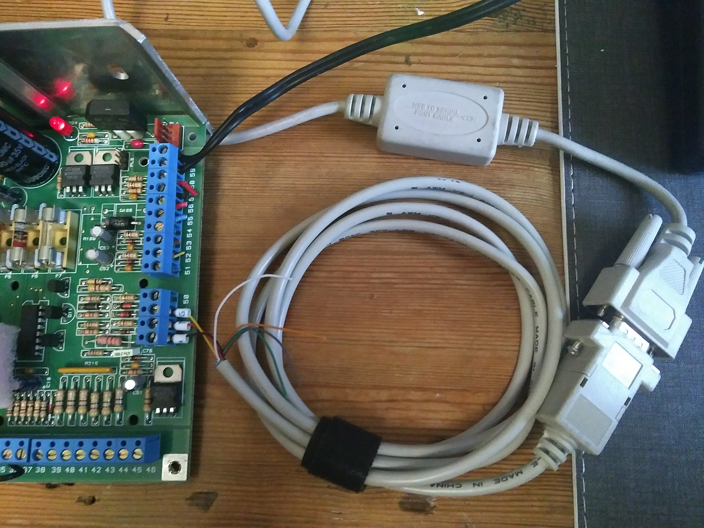

# Tools for emulating a display unit
This directory contains some python code that can be used to emulate a display
unit. You can run these tools on a regular PC or laptop (or really any platform
that can run Python) and has a RS232 serial port (easiest is a USB RS232
adapter).

There are three files:
 - `display.py` is a tool that interactively emulates a display: It
   shows the screen content that a display unit would show and takes
   keyboard input to send buttonpresses to the panel.
 - `trycodes.py` is a tool that tries all possible access codes, keeping
   track of any codes that might be correct.
 - `protocol.py` is the code that actually implements the protocol and
   is used by the other two files (it should not be called directly, but
   can be used for developing your own tool if needed).

## System requirements
This code has been tested on Linux (Ubuntu). In theory it should be
portable to e.g. Windows and OSX, but this has not been tested (and the
non-standard baudrate might be problematic).

The code requires:
 - Python 3.7
 - The [readchar](https://pypi.org/project/readchar/) python package
   (for `display.py`, not needed for `trycodes.py`). Install with either
   of:
   ```
   sudo apt install python3-readchar
   pip install --user readchar
   ```
## Connecting computer with RS232
The display bus is essentially just a duplex RS232 bus in terms of
voltage and polariy, except that to allow multiple displays, a display
module should probably never actively drive an idle signal.

In practice, you can connect an RS232 port (e.g. USB-to-RS232 adapter)
directly to the panel using the following connections (which terminals
are A/B/C/D is typically shown on a pinout diagram on the inside of the
panel enclosure, I have [some pictures of those in this
repo](../Hardware/Photos)).

| Panel side | RS232 side    |
| ---------- | ------------- |
| A: 12V     | Not connected |
| B: GND     | GND           |
| C: RX      | TxD           |
| D: TX      | RxD           |

A direct connection works, no additional components needed.



(Do not attach value to the wire colors in this photo - it uses black
and red for RxD and TxD which makes me twitch, but this was just what
the serial cable I cut in half was using inside...)

For debugging and development, it can be handy to also connect the
original display unit to see its view on the display contents. If you
do, connect RS232 and display unit in parallel to te panel, but **make
sure C is connected to only one of them**, otherwise both will be
transmitting on the same line and things will break.

Note that you could also use a USB-to-UART converter (or UART pins on
a raspberry pi or other SBC) that uses TTL UART instead of RS232, but
then you need some circuitry to translate the voltage levels and invert
the signal. For example, the circuit [suggested by the CastleAritech
project](https://github.com/OzmoOzmo/CastleAritechArduinoRKP/blob/master/HowTo/TheOptionalCircuitToBuild.png)
should work for that.

## Baudrate
The baudrate used by this bus is 1953 (512μs/bit), which is a very
non-standard baudrate. Under Linux, not all (combinations of) serial
hardware and serial terminal software supports non-standard baudrates.

This setup has been tested with a PL2303 USB-to-RS232 converter, which
supports the baudrate from python (but not using `minicom` or `stty`).

## Using `display.py`
To start this tool, open a shell in this directory and simply run
`./display.py` (for linux, or `python3 display.py` on other platforms).

Pass `--help` to get a list of options. In particular, use:
 - `--address` to set the address of the display to emulate. The default
   0 address is usually fine.
 - `--port` to set the serial port to use. The default works for most
   USB-emulated serial ports under linux (assuming you have only one).
 - Various `--print-raw-*` options to print raw data for debugging.

For example:

```
$ ./display.py --print-buttons
Available keys: 0-9, ENTER, ESC/BACKSPACE, UP, DOWN, p for panic
Unknown display byte: 0x2
[Version06.22    ] [   ]
[Mon  2 Mar 02:01] [AW ]
2023-03-29 19:07:06,882 DEBUG    Button: 0xa
[Geef Kode       ] [AW ]
2023-03-29 19:07:09,970 DEBUG    Button: 0x1
[Geef Kode      *] [AW ]
2023-03-29 19:07:10,802 DEBUG    Button: 0x1
[Geef Kode     **] [AW ]
2023-03-29 19:07:11,730 DEBUG    Button: 0x2
[Geef Kode    ***] [AW ]
2023-03-29 19:07:12,643 DEBUG    Button: 0x2
[Uitschakelen?   ] [AW ]
[In Alarmgeheugen] [ W ]
[     001 Sabotag] [ W ]
2023-03-29 19:07:18,579 DEBUG    Button: 0xf
[Systeem Uit     ] [ W ]
[EEPROM 128      ] [ W ]
2023-03-29 19:07:24,499 DEBUG    Button: 0xa
[Geef Kode       ] [ W ]
2023-03-29 19:07:25,291 DEBUG    Button: 0x1
[Geef Kode      *] [ W ]
2023-03-29 19:07:25,891 DEBUG    Button: 0x2
[Geef Kode     **] [ W ]
2023-03-29 19:07:27,145 DEBUG    Button: 0x7
[Geef Kode    ***] [ W ]
2023-03-29 19:07:27,659 DEBUG    Button: 0x8
[Inst.Menu Toets↓] [ W ]
2023-03-29 19:07:30,499 DEBUG    Button: 0xc
[Onderhoud       ] [ W ]
```

In addition to the screen contents, three state letters are shown to the
right:
 - `[A  ]` means the alarm is active (alarm led on a display unit)
 - `[ W ]` means a warning is active (warning/failure led on display unit)
 - `[  B]` means the beeper is active (display unit would beep)

## Using `trycodes.py`
To start this tool, open a shell in this directory and simply run
`./trycodes.py` (for linux, or `python3 trycodes.py` on other
platforms).

By default, this will just start with code 1111 and try every code up to
999999 (which will take over 2 months, see below).

Pass `--help` to get a list of options. In particular, these options are
available:
 - The options documented for `display.py` above.
 - `--first-code` to start at another code (or continue an interrupted
   run).
 - `--progress` to print a message for every code tried.
 - `--print-buttons` and `--print-display-updates` to see exactly the
   input and output (useful to check that communication is happening
   correctly).

When the script finds a (possibly) correct code, it is printed. Also,
when the script is terminated (by pressing ^C, because of an error or
because it is done) it should print a list of (possibly) correct codes
it found. But to ensure any codes found are not lost, it is recommended
to log the output to a file. The easiest is using `tee`. The recommended
way to run this tool is:

    ./trycodes.py --first-code 1111 --progress | tee -i -a trycodes.log

This uses `tee` with `-i` to ignore ^C (to prevent killing tee before it
can log the summary) and `-a` to append in case you need to restart the
process.


For example:

```
$ ./trycodes.py --first-code 1121 --progress | tee -i -a trycodes.log
2023-03-29 19:09:05,540 ERROR    Checksum error: 60261a760143a49077
(expected 0x8e, found 0x77)
Unknown display byte: 0x2
Unknown display byte: 0x2
2023-03-29 19:09:09,181 INFO     Trying 1121
2023-03-29 19:09:11,815 INFO     Trying 1122
2023-03-29 19:09:12,786 INFO     Code 1122: Maybe correct, response: Uitschakelen?
2023-03-29 19:09:16,359 INFO     Trying 1123
2023-03-29 19:09:18,883 INFO     Trying 1124
2023-03-29 19:09:21,580 INFO     Trying 1125
^C

Next code to try: 1126
Some codes found:
  Code 1122: Maybe correct, response: Uitschakelen?

```

## Startup checksum errors
When starting these tools when the panel is already powered up, you
might get a single checksum error on startup. This is expected, as the
panel is already transmitting data and you will likely start receiving
halfway through a packet.

Similarly, the first message you see might be a display unit failure
("RBD storing" in Dutch), because before you started the tool, the panel
was not receiving replies from any display unit (but that failure should
clear soon after starting either tool).

## Stability
During testing, I have observed that the panel sometimes stopped
responding, needing a power cycle (and sometimes being off for longer)
to become responsive again. At some point I noticed that the EEPROM chip
was not properly seated in the socket, so that was probably the cause of
these issues. After properly inserting it, it tested over 9000 codes
(yes, literally) without further issues.

## Bruteforce speed
Trying a single code takes 2-3 seconds (the CD15 seems a little faster
at 1.5 second), plus a 90-second sabotage lockout every 10 codes, which
adds another 9 seconds per code. This means that:

 - There are 9⁴ four-digit codes (not 10⁴ because zeros are not valid),
   so trying all of them should take 6561 codes × 12 seconds/code = 22
   hours.
 - There are 9⁵ five-digit codes, so trying all these should take 59049
   codes × 12 seconds/code = 8 days.
 - There are 9⁶ six-digit codes, so trying all these should take 531441
   codes × 12 seconds/code = 74 days.

This time could be improved by automatically forcing a power cycle to
skip the sabotage lockout. This should reduce the time roughly to
a quarter. This powercycling needs some extra hardware (probably a FET
or relay controlled by an RS232 handshaking pin) and has not been
implemented in software, but should be easy if needed. Another slight
improvement could be made by skipping the 0-keypresses before a new
code, and just directly trying a new code as soon as the access denied
message has disappeared.

## Entering codes
Here are some observations about how the panel processes access codes.
 - After submitting a code, the panel shows a response about 4-5s
   after the last keypress, except for 6-digit codes and correct codes,
   then a response is returned immediately.
 - If a code is correct, the panel immediately returns a response, so
   there is no need to wait these 4-5s for an access denied message (the
   code waits a short while and assumes no response means denied, which
   seems to work well).
 - After 10 invalid codes, the display shows 'Kode Sabotage89', with the
   number counting down‚ refusing new tries for 90 seconds.
 - While the display show "No access" ("Geen toegang"), it does not
   accept new codes.
 - A new code can be submitted directly when the display is idle, but
   you can also first press "0" to cancel any pending prompts or codes.
   When pressing "0" when idle, the display will ask for a code (but
   this "0" can be omitted.
